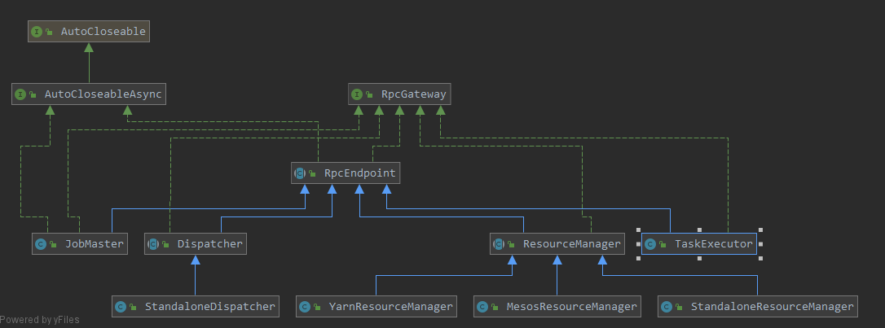
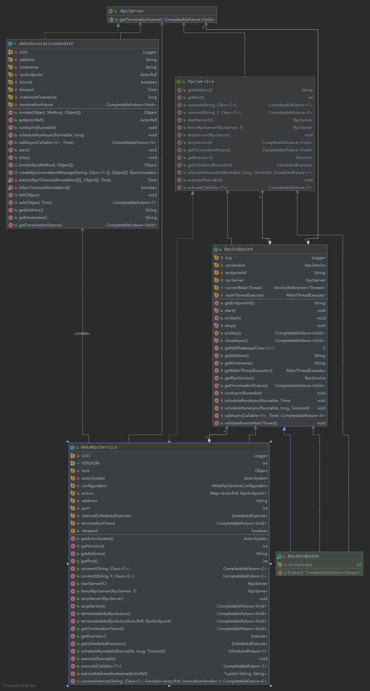

## FLINK-RPC

# flink 
rpc组件



flink各组件扩展RpcEndPoint，利用内置的Akka做分布式通讯。

各组件都会通过RpcGateWay定义接口功能,只要获取对应远程的网关接口，就可以调用远程方法
```java

public interface JobMasterGateway extends
	CheckpointCoordinatorGateway,
	FencedRpcGateway<JobMasterId>,
	KvStateLocationOracle,
	KvStateRegistryGateway {


    // 例如cancel task
	CompletableFuture<Acknowledge> cancel(@RpcTimeout Time timeout);


	CompletableFuture<Acknowledge> updateTaskExecutionState(
			final TaskExecutionState taskExecutionState);


	CompletableFuture<SerializedInputSplit> requestNextInputSplit(
			final JobVertexID vertexID,
			final ExecutionAttemptID executionAttempt);

	CompletableFuture<ExecutionState> requestPartitionState(
			final IntermediateDataSetID intermediateResultId,
			final ResultPartitionID partitionId);


	CompletableFuture<Acknowledge> scheduleOrUpdateConsumers(
			final ResultPartitionID partitionID,
			@RpcTimeout final Time timeout);


	CompletableFuture<Acknowledge> disconnectTaskManager(ResourceID resourceID, Exception cause);


	void disconnectResourceManager(
		final ResourceManagerId resourceManagerId,
		final Exception cause);


	CompletableFuture<Collection<SlotOffer>> offerSlots(
			final ResourceID taskManagerId,
			final Collection<SlotOffer> slots,
			@RpcTimeout final Time timeout);


	void failSlot(final ResourceID taskManagerId,
			final AllocationID allocationId,
			final Exception cause);


	CompletableFuture<RegistrationResponse> registerTaskManager(
			final String taskManagerRpcAddress,
			final TaskManagerLocation taskManagerLocation,
			@RpcTimeout final Time timeout);

	void heartbeatFromTaskManager(
		final ResourceID resourceID,
		final AccumulatorReport accumulatorReport);


	void heartbeatFromResourceManager(final ResourceID resourceID);

	CompletableFuture<JobDetails> requestJobDetails(@RpcTimeout Time timeout);

	CompletableFuture<JobStatus> requestJobStatus(@RpcTimeout Time timeout);

	CompletableFuture<ArchivedExecutionGraph> requestJob(@RpcTimeout Time timeout);


	CompletableFuture<String> triggerSavepoint(
		@Nullable final String targetDirectory,
		final boolean cancelJob,
		@RpcTimeout final Time timeout);

	CompletableFuture<String> stopWithSavepoint(
		@Nullable final String targetDirectory,
		final boolean advanceToEndOfEventTime,
		@RpcTimeout final Time timeout);


	CompletableFuture<OperatorBackPressureStatsResponse> requestOperatorBackPressureStats(JobVertexID jobVertexId);


	void notifyAllocationFailure(AllocationID allocationID, Exception cause);

	CompletableFuture<Object> updateGlobalAggregate(String aggregateName, Object aggregand, byte[] serializedAggregationFunction);
}
```

[cancel task](../flink-runtime/src/main/java/org/apache/flink/runtime/executiongraph/Execution.java)
```java

	// 向TaskManagerGateway 发送cancel 消息
	private void sendCancelRpcCall(int numberRetries) {
		final LogicalSlot slot = assignedResource;

		if (slot != null) {
			final TaskManagerGateway taskManagerGateway = slot.getTaskManagerGateway();
			final ComponentMainThreadExecutor jobMasterMainThreadExecutor =
				getVertex().getExecutionGraph().getJobMasterMainThreadExecutor();

			CompletableFuture<Acknowledge> cancelResultFuture = FutureUtils.retry(
				() -> taskManagerGateway.cancelTask(attemptId, rpcTimeout),
				numberRetries,
				jobMasterMainThreadExecutor);

			cancelResultFuture.whenComplete(
				(ack, failure) -> {
					if (failure != null) {
						fail(new Exception("Task could not be canceled.", failure));
					}
				});
		}
	}

```

如何实现的呢？


[demo](../flink-runtime/src/test/java/org/apache/flink/runtime/rpc/AsyncCallsTest.java)

>> 定义基本功能接口
```java
	public interface TestGateway extends RpcGateway {

		void someCall();

		void anotherCall();
	}

```
>> 实现类
```java

private static class TestEndpoint extends RpcEndpoint implements TestGateway {

		private final ReentrantLock lock;

		private final AtomicBoolean concurrentAccess;

		TestEndpoint(RpcService rpcService, ReentrantLock lock, AtomicBoolean concurrentAccess) {
			super(rpcService);
			this.lock = lock;
			this.concurrentAccess = concurrentAccess;
		}

		@Override
		public void someCall() {
			boolean holdsLock = lock.tryLock();
			if (holdsLock) {
				lock.unlock();
			} else {
				concurrentAccess.set(true);
			}
		}

		@Override
		public void anotherCall() {
			boolean holdsLock = lock.tryLock();
			if (holdsLock) {
				lock.unlock();
			} else {
				concurrentAccess.set(true);
			}
		}
	}


```
flink rpc都是由akka实现的 RpcService,所以AKKA
```java
	private static final ActorSystem actorSystem = AkkaUtils.createDefaultActorSystem();

	private static final Time timeout = Time.seconds(10L);

	private static final AkkaRpcService akkaRpcService =
			new AkkaRpcService(actorSystem, AkkaRpcServiceConfiguration.defaultConfiguration());

```
 TestEndPoint 实例化的时候调父类 EndPoint的 构造方法
 [RpcEndpoint](../flink-runtime/src/main/java/org/apache/flink/runtime/rpc/RpcEndpoint.java)
```java
 

 
 	/**
 	 * Initializes the RPC endpoint.
 	 *
 	 * @param rpcService The RPC server that dispatches calls to this RPC endpoint.
 	 * @param endpointId Unique identifier for this endpoint
 	 */
 	protected RpcEndpoint(final RpcService rpcService, final String endpointId) {
 		this.rpcService = checkNotNull(rpcService, "rpcService");
 		this.endpointId = checkNotNull(endpointId, "endpointId");
         // invokerhandler
 		this.rpcServer = rpcService.startServer(this);
 
 		this.mainThreadExecutor = new MainThreadExecutor(rpcServer, this::validateRunsInMainThread);
 	} 

```

[AkkaRpcService](../flink-runtime/src/main/java/org/apache/flink/runtime/rpc/akka/AkkaRpcService.java)
```java

@Override
	public <C extends RpcEndpoint & RpcGateway> RpcServer startServer(C rpcEndpoint) {
		checkNotNull(rpcEndpoint, "rpc endpoint");

		CompletableFuture<Void> terminationFuture = new CompletableFuture<>();
		final Props akkaRpcActorProps;

		if (rpcEndpoint instanceof FencedRpcEndpoint) {
			akkaRpcActorProps = Props.create(
				FencedAkkaRpcActor.class,
				rpcEndpoint,
				terminationFuture,
				getVersion(),
				configuration.getMaximumFramesize());
		} else {
			akkaRpcActorProps = Props.create(
				AkkaRpcActor.class,
				rpcEndpoint,
				terminationFuture,
				getVersion(),
				configuration.getMaximumFramesize());
		}

		ActorRef actorRef;

		synchronized (lock) {
			checkState(!stopped, "RpcService is stopped");
			actorRef = actorSystem.actorOf(akkaRpcActorProps, rpcEndpoint.getEndpointId());
			actors.put(actorRef, rpcEndpoint);
		}

		LOG.info("Starting RPC endpoint for {} at {} .", rpcEndpoint.getClass().getName(), actorRef.path());

		final String akkaAddress = AkkaUtils.getAkkaURL(actorSystem, actorRef);
		final String hostname;
		Option<String> host = actorRef.path().address().host();
		if (host.isEmpty()) {
			hostname = "localhost";
		} else {
			hostname = host.get();
		}

		Set<Class<?>> implementedRpcGateways = new HashSet<>(RpcUtils.extractImplementedRpcGateways(rpcEndpoint.getClass()));

		implementedRpcGateways.add(RpcServer.class);
		implementedRpcGateways.add(AkkaBasedEndpoint.class);

		final InvocationHandler akkaInvocationHandler;

		if (rpcEndpoint instanceof FencedRpcEndpoint) {
			// a FencedRpcEndpoint needs a FencedAkkaInvocationHandler
			akkaInvocationHandler = new FencedAkkaInvocationHandler<>(
				akkaAddress,
				hostname,
				actorRef,
				configuration.getTimeout(),
				configuration.getMaximumFramesize(),
				terminationFuture,
				((FencedRpcEndpoint<?>) rpcEndpoint)::getFencingToken);

			implementedRpcGateways.add(FencedMainThreadExecutable.class);
		} else {
			akkaInvocationHandler = new AkkaInvocationHandler(
				akkaAddress,
				hostname,
				actorRef,
				configuration.getTimeout(),
				configuration.getMaximumFramesize(),
				terminationFuture);
		}

		// Rather than using the System ClassLoader directly, we derive the ClassLoader
		// from this class . That works better in cases where Flink runs embedded and all Flink
		// code is loaded dynamically (for example from an OSGI bundle) through a custom ClassLoader
		ClassLoader classLoader = getClass().getClassLoader();

		@SuppressWarnings("unchecked")
		RpcServer server = (RpcServer) Proxy.newProxyInstance(
			classLoader,
			implementedRpcGateways.toArray(new Class<?>[implementedRpcGateways.size()]),
			akkaInvocationHandler);

		return server;
	}
```
其中 AkkaInvocationHandler对接口做了增强(proxy)
[AkkaInvocationHandler](../flink-runtime/src/main/java/org/apache/flink/runtime/rpc/akka/AkkaInvocationHandler.java)
```java
@Override
	public Object invoke(Object proxy, Method method, Object[] args) throws Throwable {
		Class<?> declaringClass = method.getDeclaringClass();

		Object result;

		if (declaringClass.equals(AkkaBasedEndpoint.class) ||
			declaringClass.equals(Object.class) ||
			declaringClass.equals(RpcGateway.class) ||
			declaringClass.equals(StartStoppable.class) ||
			declaringClass.equals(MainThreadExecutable.class) ||
			declaringClass.equals(RpcServer.class)) {
			result = method.invoke(this, args);
		} else if (declaringClass.equals(FencedRpcGateway.class)) {
			throw new UnsupportedOperationException("AkkaInvocationHandler does not support the call FencedRpcGateway#" +
				method.getName() + ". This indicates that you retrieved a FencedRpcGateway without specifying a " +
				"fencing token. Please use RpcService#connect(RpcService, F, Time) with F being the fencing token to " +
				"retrieve a properly FencedRpcGateway.");
		} else {
			result = invokeRpc(method, args);
		}

		return result;
	}
	
		
```

```java

private Object invokeRpc(Method method, Object[] args) throws Exception {
    		String methodName = method.getName();
    		Class<?>[] parameterTypes = method.getParameterTypes();
    		Annotation[][] parameterAnnotations = method.getParameterAnnotations();
    		Time futureTimeout = extractRpcTimeout(parameterAnnotations, args, timeout);
    
    		final RpcInvocation rpcInvocation = createRpcInvocationMessage(methodName, parameterTypes, args);
    
    		Class<?> returnType = method.getReturnType();
    
    		final Object result;
    
    		if (Objects.equals(returnType, Void.TYPE)) {
    			tell(rpcInvocation);
    
    			result = null;
    		} else {
    			// execute an asynchronous call
    			CompletableFuture<?> resultFuture = ask(rpcInvocation, futureTimeout);
    
    			CompletableFuture<?> completableFuture = resultFuture.thenApply((Object o) -> {
    				if (o instanceof SerializedValue) {
    					try {
    						return  ((SerializedValue<?>) o).deserializeValue(getClass().getClassLoader());
    					} catch (IOException | ClassNotFoundException e) {
    						throw new CompletionException(
    							new RpcException("Could not deserialize the serialized payload of RPC method : "
    								+ methodName, e));
    					}
    				} else {
    					return o;
    				}
    			});
    
    			if (Objects.equals(returnType, CompletableFuture.class)) {
    				result = completableFuture;
    			} else {
    				try {
    					result = completableFuture.get(futureTimeout.getSize(), futureTimeout.getUnit());
    				} catch (ExecutionException ee) {
    					throw new RpcException("Failure while obtaining synchronous RPC result.", ExceptionUtils.stripExecutionException(ee));
    				}
    			}
    		}
    
    		return result;
    	}
    	
    	
    	
    	// private final ActorRef rpcEndpoint;
    	
    	// actorRef => AkkaRpcActor contais rpcEndpoint
    		if (rpcEndpoint instanceof FencedRpcEndpoint) {
        			akkaRpcActorProps = Props.create(
        				FencedAkkaRpcActor.class,
        				rpcEndpoint,
        				terminationFuture,
        				getVersion(),
        				configuration.getMaximumFramesize());
        		} else {
        			akkaRpcActorProps = Props.create(
        				AkkaRpcActor.class,
        				rpcEndpoint,
        				terminationFuture,
        				getVersion(),
        				configuration.getMaximumFramesize());
        		}
        
        		ActorRef actorRef;
        
        		synchronized (lock) {
        			checkState(!stopped, "RpcService is stopped");
        			actorRef = actorSystem.actorOf(akkaRpcActorProps, rpcEndpoint.getEndpointId());
        			actors.put(actorRef, rpcEndpoint);
        		}

    	    // Akka method
    		protected void tell(Object message) {
        		rpcEndpoint.tell(message, ActorRef.noSender());
        	}

```
[AkkaRpcActor](../flink-runtime/src/main/java/org/apache/flink/runtime/rpc/akka/AkkaRpcActor.java)
```java

class AkkaRpcActor<T extends RpcEndpoint & RpcGateway> extends AbstractActor {

	protected final Logger log = LoggerFactory.getLogger(getClass());

	/** the endpoint to invoke the methods on. */
	protected final T rpcEndpoint;

```


##client

```scala

    val fooGateWay: CompletableFuture[FooGateWay] =
      new AkkaRpcService(actorSystem2, AkkaRpcServiceConfiguration.defaultConfiguration)
        .connect(address, classOf[FooGateWay])

```

```scala

server(endpoint)
   ||
   ||==>AkkaRpcActor(has the endpoint ref)
        ||
        || recive
        ||==>handleMessage
               ||
               ||==> invoke(endpoint,args)

```

rpcserver 代理整个akkaactor的生命周期，AkkaRpcActor包含endPoint的引用，接受rpc，然后反射调用endpoint的method


[所以整个流程是这样的](../flink-runtime/src/test/scala/myakkatest.scala)
```scala

client(proxy)
     || 
     ||==> invoke ()
         ||
         || ==> sendRpc(prepare param)
                   ||
                   ||==> actorRef(remote)
                             ||
                             ||==akka frameworksend
                                             ||
                                             ||== AkkaRpcActor(remoteActor)
                                                      ||
                                                      ||==> revice(handleRpcMessage)
                                                      

```
客户端只要给出一个address，代理的实例，调方法时，使用了jdk代理，把参数分装为rpcinvocation，由于已经连接了actor，通过actor把rpcinvocation发过去，

akkaRpcActor接受rpcinvocation，执行，返回给client。

