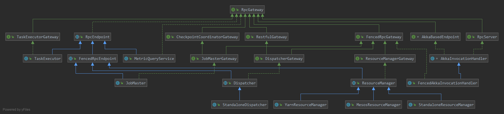

flink 任務提交流程

Dispatcher 实现了RestFulGateWay, 接口定义了web查询job信息,
```java

	CompletableFuture<Acknowledge> cancelJob(JobID jobId, @RpcTimeout Time timeout);

	CompletableFuture<ArchivedExecutionGraph> requestJob(JobID jobId, @RpcTimeout Time timeout);
	
	CompletableFuture<JobResult> requestJobResult(JobID jobId, @RpcTimeout Time timeout);
	
	CompletableFuture<MultipleJobsDetails> requestMultipleJobDetails(
		@RpcTimeout Time timeout);
	
	CompletableFuture<ClusterOverview> requestClusterOverview(@RpcTimeout Time timeout);
	
	CompletableFuture<Collection<String>> requestMetricQueryServiceAddresses(@RpcTimeout Time timeout);
	
	CompletableFuture<Collection<Tuple2<ResourceID, String>>> requestTaskManagerMetricQueryServiceAddresses(@RpcTimeout Time timeout);
	....
```
而Disptcher实现了submitJob 
```java
CompletableFuture<Acknowledge> submitJob(
		JobGraph jobGraph,
		@RpcTimeout Time timeout);
```

Dispatch 生成JobGraph 提交给JobMaster,先持久化jobgraph，然后run

```java

private CompletableFuture<Void> persistAndRunJob(JobGraph jobGraph) throws Exception {
		jobGraphStore.putJobGraph(jobGraph);

		final CompletableFuture<Void> runJobFuture = runJob(jobGraph);

		return runJobFuture.whenComplete(BiConsumerWithException.unchecked((Object ignored, Throwable throwable) -> {
			if (throwable != null) {
				jobGraphStore.removeJobGraph(jobGraph.getJobID());
			}
		}));
	}

	private CompletableFuture<Void> runJob(JobGraph jobGraph) {
		Preconditions.checkState(!jobManagerRunnerFutures.containsKey(jobGraph.getJobID()));

		final CompletableFuture<JobManagerRunner> jobManagerRunnerFuture = createJobManagerRunner(jobGraph);

		jobManagerRunnerFutures.put(jobGraph.getJobID(), jobManagerRunnerFuture);

		return jobManagerRunnerFuture
			.thenApply(FunctionUtils.uncheckedFunction(this::startJobManagerRunner))
			.thenApply(FunctionUtils.nullFn())
			.whenCompleteAsync(
				(ignored, throwable) -> {
					if (throwable != null) {
						jobManagerRunnerFutures.remove(jobGraph.getJobID());
					}
				},
				getMainThreadExecutor());
	}

```
