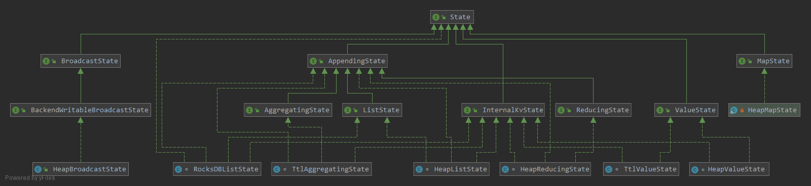

# **_[state&&checkpoint]_**




state的构成类图,state主要保存runtime时的userfunction产生的结果,可以保存这些结果为checkpoint。


ValueState,AppendingStat为KeyedState, BroadcastState是operatoeState和key无关，ListState 既是KeyedState也是OperatoeState

## ValueState

为每个key保存一个value
```java

      env.fromElements("1","2","3","2 3 1").flatMap(new FlatMapFunction<String, Tuple2<String, Long>>()  {

            @Override
            public void flatMap(String s, Collector<Tuple2<String, Long>> collector) throws Exception {
            String[] strings = s.split(" ");

            for (String string : strings) {
                collector.collect(new Tuple2(string,1L));
            }

        }}
        )
                .keyBy(0)
                .reduce((ReduceFunction<Tuple2<String, Long>>) (old, ne) -> { // 使用的是ValueState

                    System.err.println(new Tuple2(old,ne));
                    TimeUnit.MILLISECONDS.sleep(1);
                    return new Tuple2(old.f0,old.f1+ne.f1);
                }).print();


@Internal
public class StreamGroupedReduce<IN> extends AbstractUdfStreamOperator<IN, ReduceFunction<IN>>
		implements OneInputStreamOperator<IN, IN> {

	private static final long serialVersionUID = 1L;

	private static final String STATE_NAME = "_op_state";

	private transient ValueState<IN> values;
	
	
	    // 通过userfunction update value
	   
		@Override
    	public void processElement(StreamRecord<IN> element) throws Exception {
    		IN value = element.getValue();
    		IN currentValue = values.value();
    
    		if (currentValue != null) {
    			IN reduced = userFunction.reduce(currentValue, value);
    			values.update(reduced);
    			output.collect(element.replace(reduced));
    		} else {
    			values.update(value);
    			output.collect(element.replace(value));
    		}
    	}
	
}


public abstract class AbstractHeapState<K, N, SV> implements InternalKvState<K, N, SV> {

	/** Map containing the actual key/value pairs. */
	// 每个Key subtask 保存的一个Map 结构的数据结构，保存对应key的value
	protected final StateTable<K, N, SV> stateTable;

	/** The current namespace, which the access methods will refer to. */
	protected N currentNamespace;

	protected final TypeSerializer<K> keySerializer;

	protected final TypeSerializer<SV> valueSerializer;

	protected final TypeSerializer<N> namespaceSerializer;

	private final SV defaultValue;
}

```


