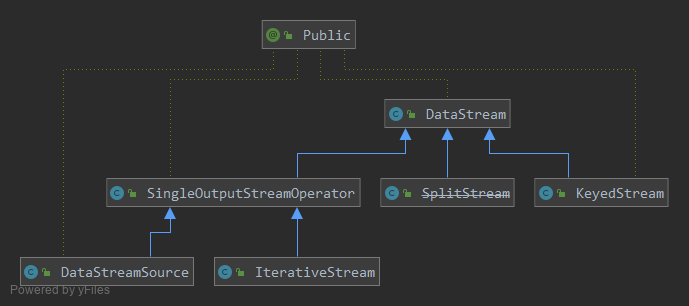
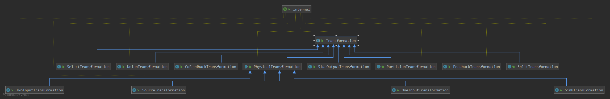
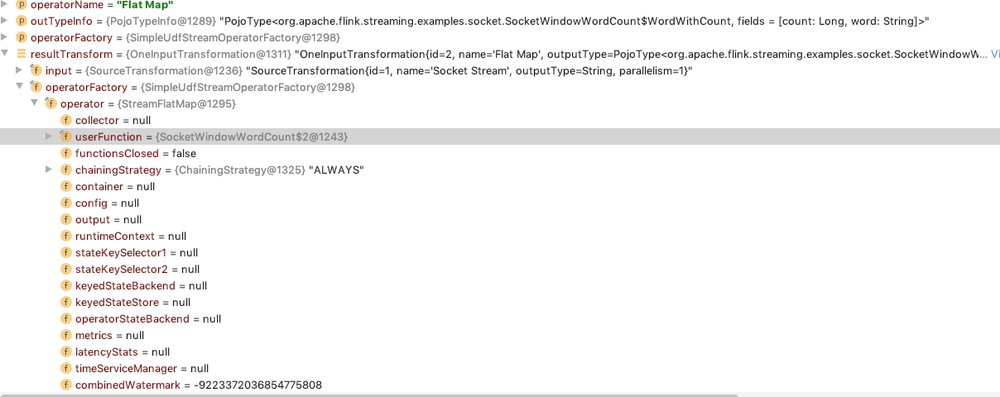

### stream 

		DataStream<WordWithCount> windowCounts = text

				.flatMap(new FlatMapFunction<String, WordWithCount>() {
					@Override
					public void flatMap(String value, Collector<WordWithCount> out) {
						for (String word : value.split("\\s")) {
							out.collect(new WordWithCount(word, 1L));
						}
					}
				})

				.keyBy("word")
				//.timeWindow(Time.seconds(5))

				.reduce(new ReduceFunction<WordWithCount>() {
					@Override
					public WordWithCount reduce(WordWithCount a, WordWithCount b) {
						return new WordWithCount(a.word, a.count + b.count);
					}
				});

datastream 的定义不同于dataset, dataset 作为batch， 类似于spark的batch定义， 对数据源的操作，如map，fliter，groupBy flatmap等

都是对于同一个文件分片处理，如果没必要分片的话。所以dataset的定义算子比较丰富。

而datastream 的子类则比较单一了

dataStream的算子都 基本都是由 keyedStram 和 SingleOutputStreamOperator定义

keyed 用于自定义分区, 类似于kafka中的key, hash（分片算法之一）分发到不同的下游数据。
SingleOutputStreamOperator 就是对本数据流中的数据处理 如  map, flatmap, filter。
SplitStream 由input 自定义需要的数据，自定义tag，向下游选择性的分发数据。

客户端程序写的其实都是transformation，对于map，flatmap这种都是物理转换，还有select都是虚拟的转换。

我们写的client程序 一般写transformation

在client

由图可见，在client比较重要的是userfunction和 typeInfo 用于byte的序列化。还有一些其他的资源配置信息。

	public KeyedStream(DataStream<T> dataStream, KeySelector<T, KEY> keySelector, TypeInformation<KEY> keyType) {
		this(
			dataStream,
			new PartitionTransformation<>(
				dataStream.getTransformation(),
				new KeyGroupStreamPartitioner<>(keySelector, StreamGraphGenerator.DEFAULT_LOWER_BOUND_MAX_PARALLELISM)),
			keySelector,
			keyType);
	}

   KeyedStream 是用于shuffle，主要对于upstream，选择一个下游发送数据，
   /**
    * This transformation represents a change of partitioning of the input elements.
    *
    * 
This does not create a physical operation, it only affects how upstream operations are
    * connected to downstream operations.
    *
    * @param <T> The type of the elements that result from this {@code PartitionTransformation}
    */
    描述也很简单易懂。对于同一个key的处理，
    
    最后一个reduce算子是聚合算子，keyedStream 
    当第一次来时，存放与state中，第二次来时，从state中取出来进行reduce function。
    
    至此，flink 及stream 系统的核心api算子已经介绍完了。下一步优化算子，streamgraph。
                          
                          

